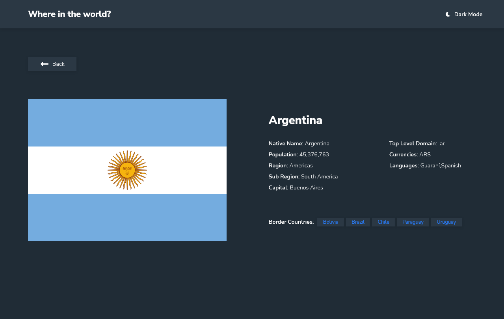

# Space Tourism Front mentor mobile responsive  challenge

## For live preview click  <strong>[here](https://marco-polo-portfolio-app.netlify.app/)</strong> 

## Desktop design overview home page

## Tablet design overview  single page dark mode on

## Mobile design overview  mobile single page

## Development setup
1. Clone the repo
2. npm install
3. npm run start

##  About Space Tourism
> This project is a front mentor challenge ( [Front Mentor link ](https://www.frontendmentor.io/home))

## Build With

1. SASS
1. TYPESCRIPT
1. REACT.JS

## Backend API "Rest Countries"
 Rest countries api link: <strong>[here](https://gitlab.com/amatos/rest-countries)</strong> 

